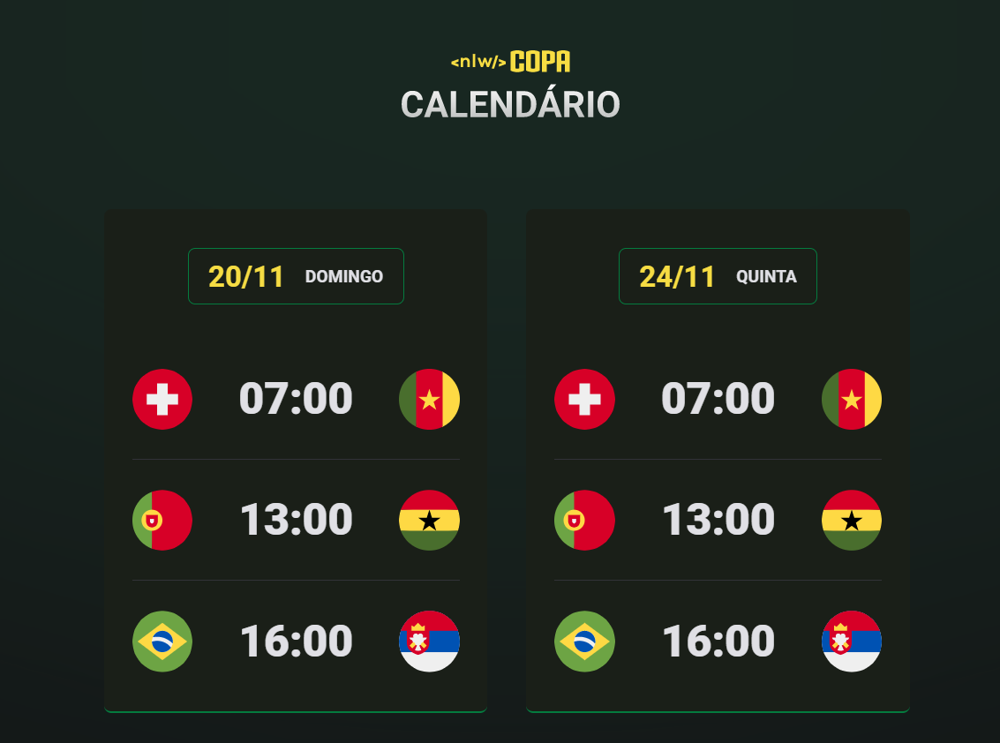

<h1 align="center">Calendário Copa do Mundo 2022</h1>

<h1 align="center">
    <a href="https://developer.mozilla.org/pt-BR/docs/Web/JavaScript"> </> Javascript</a>
</h1>
<p>🚀 Projeto desenvolvido na trilha NLW Copa do Mundo</p>
<br>
<h4 align="center">
	🚧  HTML | CSS | JAVASCRIPT 🚀 Atualização com o decorrente dos eventos  🚧
</h4>

<br>

### Funções

- [x] Mostra as bandeiras das seleções
- [x] Cards por datas dos eventos

### Preview



> 📌 Trilha NLW - novembro 22.

### 🎲 Rodando o Front End ()

```bash
# Clone este repositório
$ git clone <https://github.com/Jtomio/calendario-copa>

# Acesse a pasta do projeto no terminal/cmd
$ cd calendario-copa

# Abra o projeto no VScode
$ code .

### 🛠 Tecnologias

As seguintes ferramentas foram usadas na construção do projeto:

- [HTML](https://developer.mozilla.org/pt-BR/docs/Web/HTML)
- [CSS](https://developer.mozilla.org/pt-BR/docs/Web/CSS)
- [JavaScript](https://developer.mozilla.org/pt-BR/docs/Web/JavaScript)

```

### Autor

---

<a href="https://github.com/Jtomio">
 
 <br />
 <sub><b>Jeison Tomio</b></sub></a>

👋🏽 Entre em contato!

[](https://www.linkedin.com/in/jeison-tomio/)
[](mailto:medriase@gmail.com)

```

```
